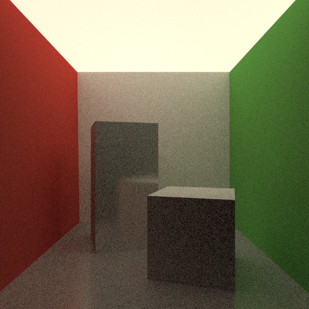

# Realistic-Image-Synthesis
Here, in this course we learned the advanced concepts of computer graphics 1 at Saarland University. The concepts we learned are: 
1. Monte Carlo Sampling  
2. Vanilla Path Tracing  
Glossy Surface | Diffuse Surface
|------------|---------|
!   |  
3. Next Event Estimation  
4. Photon Mapping and Density Estimation  
