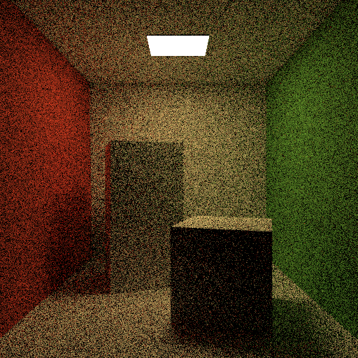
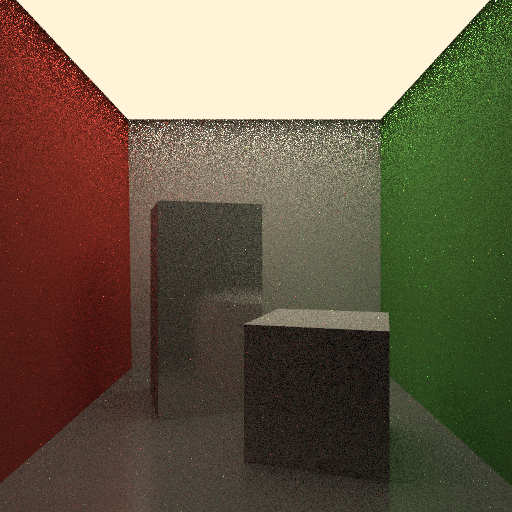
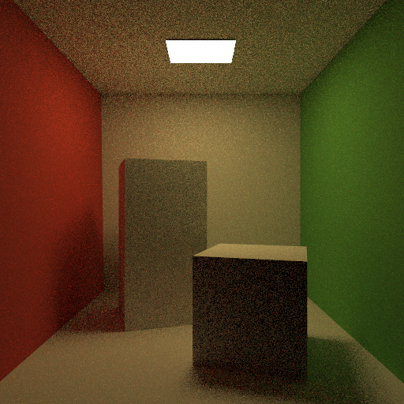
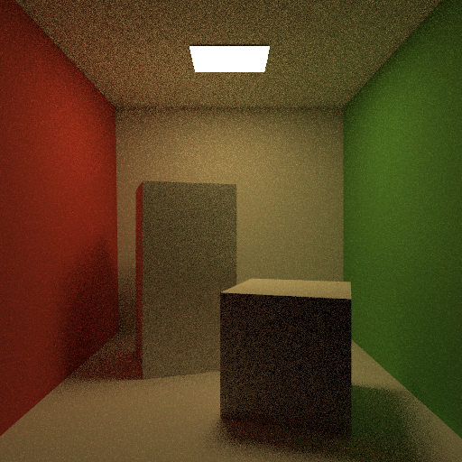
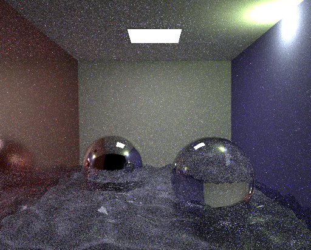

# Realistic-Image-Synthesis
Here, in this course we learned the advanced concepts of computer graphics 1 at Saarland University. The concepts we learned are: 
1. Monte Carlo Sampling  
2. Vanilla Path Tracing  
| Glossy Surface (100 spp)     | Diffuse Surface (100spp) |
| ----------- | ----------- |
|       |        |
3. Next Event Estimation  
Combination of direect lighting and path tracing.
Direct lighting:Connect to a random light sources at each hit point and collect the contributions as the ray bounces.  
Path Tracing : Collect the throughput as ray bounces off. 
MIS(Multiple Importance sampling): Combine the NEE with path tracing more effectively as NEE converge faster for some lighting conditions.
|Surfaces |NEE     | MIS |
|----------- |----------- | ----------- |
| Glossy(10 spp)|      |        |
| Diffuse(10 spp)|      |        |
| Water(200 spp)|      |        |

6. Photon Mapping and Density Estimation  
