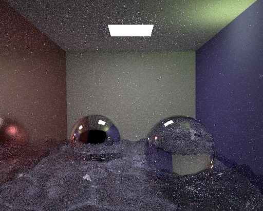

# Realistic-Image-Synthesis
Here, in this course we learned the advanced concepts of computer graphics 1 at Saarland University. The concepts we learned are: 
## 1. Monte Carlo Sampling  
## 2. Vanilla Path Tracing  

| Glossy Surface (100 spp) | Diffuse Surface (100spp) |
| :-----------: | :-----------: |
       |   

## 3. Next Event Estimation  
Combination of **direect lighting** and **path tracing**. 
**Direct lighting**:Connect to a random light sources at each hit point and collect the contributions as the ray bounces.  
**Path Tracing** : Collect the throughput as ray bounces off.  
MIS(Multiple Importance sampling): Combine the NEE with path tracing more effectively as NEE converge faster for some lighting conditions. 

Surfaces | NEE | MIS
:-----: | :----: | :-----:
Glossy(10 spp)   |  | 
Diffuse(10 spp)  |   | 
Water(200 spp)   |   | 

## 4. Photon Mapping and Density Estimation  
Combination of **photon tracing** and **Density estimation**. 
**Photon Tracing** : Shoot photons from light sources and store them at the hit pts using some acceleration structure for computing the density during density estimation. Remember to not store photons on specular surfaces.  
**Density Estimation** : Estimate the density around a point taking the contribution of all the photons in the neighbourhood of this point using some kernel (we have used epanechnikov kernel) with certain radius. We didn't perform density estimation on specular surfaces as the probablility of sampling a direction in the exact direction (in the specular lobe) is very low.  
**Direct Lighting with PM** : Glossy materials don't work well. Hence, to improve efficiency of progressive photon mapping in the presence of glossy materials is
to not do density estimation on glossy materials either. Instead, compute the direct illumination at a glossy hit point, and bounce, as you would do in path tracing. Keep in mind that you will have to either ignore hitting the light source after a glossy bounce,
or use MIS to combine direct illumination with randomly hitting the light.  

Surfaces | PM | MIS
:-----: | :----: | :-----:
Water(100 spp)   |   | 
Specular(100 spp)  |   | same as no glossy surfaces

## 5. HDR and Tone Mapping  
**HDR(High Dynamic Range)**: It captures all the dynamic range of an image. 
**TM(Tone Mapping)**: Convert the high dynamic range to displayable range without losing any details as many viewing devices are not able to display all the ranges. 
Here, we have computed HDR of two images using multi image exposure technique and performed tone mapping using 4 tone mapping techniques. 
Operators | Day Image | Night Image
:-----: | :----: | :-----:
Drago   |   | 
Durand  |   | 
Logarithmic   |   | 
Reinhard  |   | 
